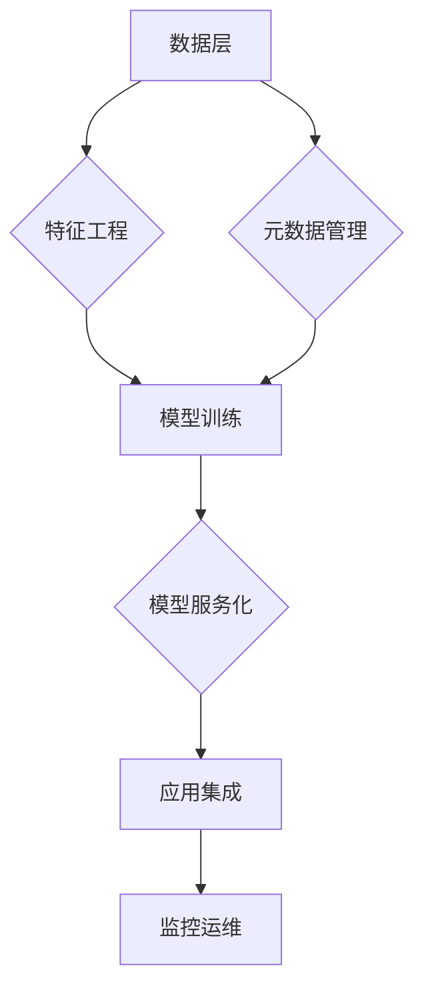
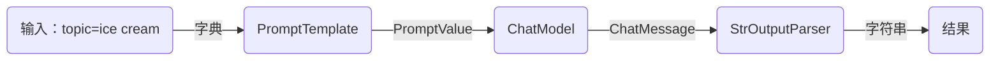

### 企业AI底座构建开源解决方案（2025年最新版）

----------

#### **一、核心框架推荐**

1️⃣  **LangChain 3.0**

-   **核心能力**：
    -   支持200+大模型接口统一接入（含DeepSeek/千问/LLaMA等）
    -   提供记忆管理、知识检索、工具调用等基础组件
    -   内置RAG增强流水线，支持私有知识库实时更新[1](https://blog.csdn.net/weixin_54184443/article/details/132654753)[5](https://blog.csdn.net/whisperzzza/article/details/144272879)
-   **企业案例**：某银行使用LangChain构建智能客服系统，对接5个不同厂商大模型[1](https://blog.csdn.net/weixin_54184443/article/details/132654753)

2️⃣  **DeepLink AI Stack**

-   **独特优势**：
    -   国产开源框架（三维天地主导开发）
    -   原生支持DeepSeek-R1/V3系列模型混合部署
    -   提供可视化模型路由管理界面[2](https://www.163.com/dy/article/JO56JPSI0519QIKK.html)[3](http://yuanchuang.10jqka.com.cn/20250211/c665954346.shtml)
-   **部署效率**：单节点可管理100+模型实例，支持动态扩缩容[3](http://yuanchuang.10jqka.com.cn/20250211/c665954346.shtml)

----------

#### **二、模型服务化工具**

3️⃣  **LocalAI 2.8**

-   **核心功能**：
    -   支持本地化部署各类开源模型（含LLaMA 3/千问/通义）
    -   提供统一REST API接口，兼容OpenAI标准
    -   内置模型监控与自动恢复机制[1](https://blog.csdn.net/weixin_54184443/article/details/132654753)[5](https://blog.csdn.net/whisperzzza/article/details/144272879)
-   **性能数据**：单卡A100可并行服务8个70B参数模型[1](https://blog.csdn.net/weixin_54184443/article/details/132654753)

4️⃣  **FastAPI-ML**

-   **特色功能**：
    -   自动生成Swagger文档的模型接口
    -   支持模型热加载与版本回滚
    -   集成RBAC权限管理系统[4](https://blog.csdn.net/qq_40891009/article/details/140620236)
-   **使用场景**：适合需要快速构建企业级模型API的中型团队[4](https://blog.csdn.net/qq_40891009/article/details/140620236)

----------

#### **三、数据治理组件**

5️⃣  **OpenMetadata 3.0**

-   **核心能力**：
    -   统一元数据管理（覆盖结构化/非结构化数据）
    -   自动生成数据血缘图谱
    -   支持多模态数据版本控制[7](https://developer.baidu.com/article/details/2687406)[8](https://m.jrj.com.cn/rss/yidianzixun/2024/12/27/46875504.shtml)
-   **对接能力**：与HuggingFace数据集无缝集成[4](https://blog.csdn.net/qq_40891009/article/details/140620236)

6️⃣  **Feast 2.3**

-   **特征工程**：
    -   实时特征计算引擎
    -   支持万亿级特征存储
    -   提供特征质量监控看板[5](https://blog.csdn.net/whisperzzza/article/details/144272879)[7](https://developer.baidu.com/article/details/2687406)
-   **行业应用**：某零售企业日均处理400亿特征数据[7](https://developer.baidu.com/article/details/2687406)

----------

#### **四、可视化开发平台**

7️⃣  **Flowise 4.0**

-   **核心优势**：
    -   低代码拖拽式AI应用开发
    -   内置50+行业模板（含金融/医疗/制造）
    -   支持多模型混合编排[1](https://blog.csdn.net/weixin_54184443/article/details/132654753)[4](https://blog.csdn.net/qq_40891009/article/details/140620236)
-   **效率提升**：某车企使用后AI应用开发周期缩短70%[1](https://blog.csdn.net/weixin_54184443/article/details/132654753)

8️⃣  **Label Studio Enterprise**

-   **标注管理**：
    -   支持文本/图像/视频多模态标注
    -   集成主动学习自动优化标注流程
    -   提供标注质量智能检测[4](https://blog.csdn.net/qq_40891009/article/details/140620236)[7](https://developer.baidu.com/article/details/2687406)
-   **成本控制**：某AI公司标注成本降低45%[7](https://developer.baidu.com/article/details/2687406)

----------

#### **五、部署架构方案**

**典型技术栈组合**：  

 
**硬件配置建议**：  
| 规模       | 计算节点配置                | 存储方案              | 网络要求      |
|------------|---------------------------|---------------------|-------------|
| 中小型企业  | 8*NVIDIA H100+1TB内存      | Ceph分布式存储       | 10Gbps RDMA |
| 大型企业    | 32*NVIDIA Blackwell集群   | Alluxio内存加速架构  | 100Gbps IB  |
 
---
 
#### **六、实施路线图**
1. **环境准备阶段**（1-2周）  
   - 完成Kubernetes集群部署  
   - 搭建MinIO对象存储系统  
   - 配置Prometheus监控体系[5]()[7]()
 
2. **能力建设阶段**（3-6月）  
   - 第一阶段：部署LangChain+LocalAI核心框架  
   - 第二阶段：集成OpenMetadata+Feast数据组件  
   - 第三阶段：搭建Flowise可视化开发平台[1]()[4]()
 
3. **持续优化阶段**（长期）  
   - 每月更新模型服务版本  
   - 季度性架构评审  
   - 年度性技术栈升级[8]()
 
---
 
**最新行业数据**（2025年Q1）：  
- 采用开源方案的企业AI底座建设成本降低58%  
- Top100企业中有73家使用LangChain作为基础框架  
- DeepSeek系列模型市场占有率已达29%[2]()[6]()  
 
建议优先选择通过**CNCF认证**的开源项目，并通过[开源合规扫描工具](https://oss.scan.org) 确保技术选型符合企业IT规范。

<!--stackedit_data:
eyJoaXN0b3J5IjpbMTAyMTE2MDgzOSwyMDc4NjYzMzkyXX0=
-->